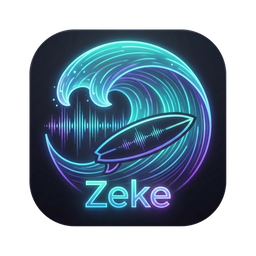

<p align="center">
  
</p>

A native Linux TIDAL player for hi-res lossless playback (up to 24-bit/192 kHz,
bit-perfect through exclusive ALSA), written in Rust with GTK4 and libadwaita.

Zeke is heavily based on [SONE](https://github.com/lullabyX/sone), a TIDAL
player built with Tauri and React: its UI follows SONE's, and the TIDAL client,
authentication, persistence and audio engine are derived from SONE's Rust
backend (GPL-3.0). `NOTICE` lists the derived files. Zeke is not affiliated
with SONE or TIDAL.

## Status

MVP: the core player is complete. What it does today:

- **Sign-in:** TIDAL login in a window of Zeke's own; the session is kept
  and refreshed.
- **Browse:** the personalized Home feed, search, favorites (tracks,
  albums, artists, playlists), and album, playlist, artist and mix pages.
- **Playback:** gapless, up to 24-bit/192 kHz, with a quality cap,
  ReplayGain, and an output menu in the player bar: the system default or
  a sound device played exclusively, bit-perfect if you like (see
  [Audio output](#audio-output)).
- **Queue:** shuffle, repeat and seek; a now-playing sheet; the queue is
  saved across restarts. Long playlists start playing before they have
  fully loaded.
- **Radio:** TIDAL's track and artist radio, from any track's menu, the
  artist page and the now-playing sheet; the station opens as a page to
  play or shuffle.
- **Continuous playback:** when the queue runs out with repeat off, the
  last track's radio follows gaplessly, so the music keeps going. It is
  on by default and can be turned off in Preferences › Playback.
- **Desktop:** a quality badge (e.g. FLAC 24/192), MPRIS media controls,
  keyboard shortcuts, light and dark styles.
- **Sleep:** the computer doesn't suspend while music plays; the screen
  still blanks and locks (see [Sleep while playing](#sleep-while-playing)).

### Next

- Lyrics
- Animated covers
- Video playback

## Audio output

The speaker button in the player bar chooses where Zeke plays. A choice
applies from the next track.

- **System Default** plays through the desktop's sound server (PipeWire),
  like any other app. It shares the card with other apps, follows the
  output chosen in the system settings, and PipeWire mixes and resamples
  as needed.
- **A device** (an ALSA hw device such as `hw:CARD=sofhdadsp,DEV=0`) is
  played exclusively. Zeke writes to the card directly, with no mixing,
  and with that device's Bit-perfect switch on, with no resampling or
  format conversion either. While it plays, no other app can use the
  card: on a laptop with a single card the system shows "Dummy Output".
  Speakers and the headphone jack are usually the same device.

**How Zeke takes the card:** PipeWire keeps a card open for as long as it
owns the card's `org.freedesktop.ReserveDevice1` D-Bus name. Before
opening a device, Zeke queues for that name and asks WirePlumber to
release it, and the bus hands the name to Zeke as WirePlumber lets the
card go. Zeke keeps the card until you switch back to System Default,
stop or quit.

**When the card is busy:** if another app has the card open directly (for
example `aplay` or JACK), Zeke says so, switches to System Default and
plays the track there. The saved device is also checked at startup: if
it's missing or another app holds it directly, Zeke starts on System
Default.

## Sleep while playing

While a track plays (or the next one loads), Zeke holds a logind lock
that keeps the computer from suspending, so an idle timeout doesn't cut a
song off. Pausing, stopping or quitting releases it. Only sleep is held
off: the screen still blanks and locks as usual. `systemd-inhibit --list`
shows the lock as `Zeke … sleep … Playing music … block`.

- A suspend you ask for is refused too while music plays: pause first,
  or use `systemctl suspend -i`.
- Closing the lid still suspends (logind's default
  `LidSwitchIgnoreInhibited=yes`).
- systemd 257 or later is needed for the lock to hold against your own
  session's idle suspend; with an older one Zeke logs a warning.

## Layout

| Path | Role |
|---|---|
| `crates/tidal` | TIDAL API, auth, settings, persistence |
| `crates/engine` | GStreamer/ALSA audio engine |
| `crates/player` | queue and playback state |
| `crates/cli` | headless test tool |
| `crates/plugins/api` | what a plugin is, and what the app gives it |
| `crates/plugins/cast` | the Cast plugin (feature `cast`; empty for now) |
| `app` | GTK4 + libadwaita application |

## Building (openSUSE Tumbleweed/Slowroll)

```sh
sudo zypper in gtk4-devel libadwaita-devel gstreamer-devel gstreamer-plugins-base-devel \
  gstreamer-plugins-good gstreamer-plugins-bad gstreamer-utils alsa-devel blueprint-compiler \
  webkitgtk4-devel libsoup-devel rustup
rustup default stable
rustup component add rust-analyzer rust-src # Optional but recommended
cargo run -p zeke
```

`make check` runs clippy on every feature combination, the tests, and a
check that a build without plugins pulls none in. It needs `cargo-hack`
(`cargo install cargo-hack --locked`).

## Installing (current user)

```sh
make install     # release build; binary, desktop entry, icon and metainfo under ~/.local
make uninstall
make validate    # desktop-file-validate and appstreamcli validate --no-net
```

Zeke then shows up in the desktop's app menu. `PREFIX=/usr/local` installs elsewhere.

## Debugging

- `ZEKE_DEBUG=1`: debug logging (every TIDAL request's turn at the client lock, queue saves).
- `ZEKE_STALLS=1`: log each main-loop stall over 16 ms.

Playback will need GStreamer's `dashdemux` (from gstreamer-plugins-bad), not `dashdemux2`.

## Plugins

Plugins are compiled in, each behind its own Cargo feature, and turned on
in Preferences › Plugins. [crates/plugins/README.md](crates/plugins/README.md)
covers how they run and how to write one.

## License

GPL-3.0. See `LICENSE` and `NOTICE`.
